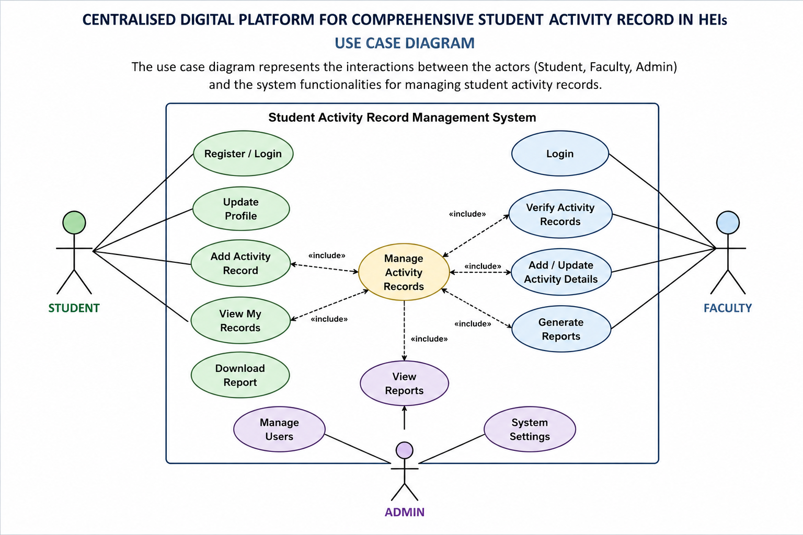
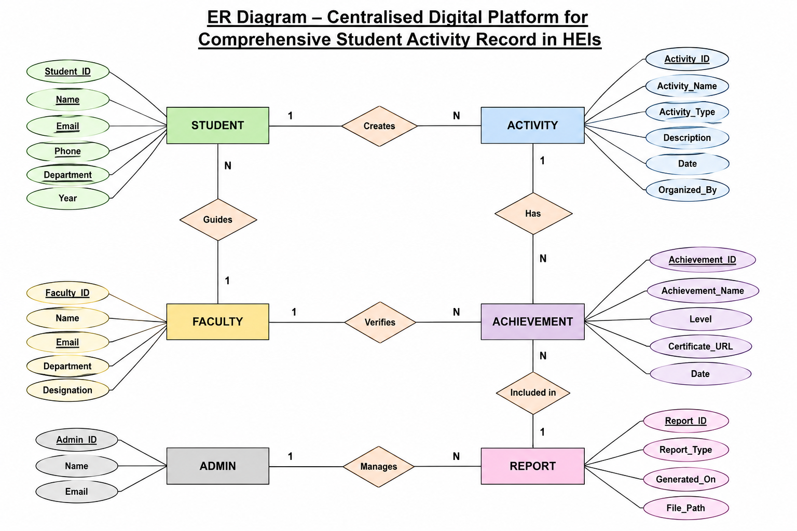

# Centralised-Digital-Platform-for-Comprehensive-Student-Activity-Record-in-HEIs


## **Project Overview**

The **Centralised Digital Platform for Comprehensive Student Activity Record in HEIs** is designed to maintain and manage all student activity records in a single digital system. The platform will store academic, co-curricular, and extracurricular achievements of students in an organized manner. It will help students, faculty members, and administrators access records easily and efficiently. The system aims to reduce paperwork, improve data accuracy, and provide a centralized solution for tracking student performance and achievements. This platform will enhance transparency, accessibility, and overall record management in Higher Education Institutions.


## **Problem Statement**

Many Higher Education Institutions maintain student activity records using separate systems, spreadsheets, or manual documentation. This makes it difficult to track and manage academic, co-curricular, and extracurricular achievements efficiently. The lack of a centralized system can lead to data duplication, loss of records, and limited accessibility. Therefore, there is a need for a centralized digital platform that securely stores, manages, and provides easy access to comprehensive student activity records for students, faculty members, and administrators.


## **Project Objectives**

- Store all student activity records in one platform.
- Maintain academic and extracurricular achievements.
- Reduce manual paperwork and record management.
- Provide easy access to student records.
- Improve data accuracy and security.


## **Module List**

- Student Registration Module
- Student Activity Management Module
- Faculty Verification Module
- Report Generation Module
- Admin Dashboard Module


## **Use Case Diagram**

The Use Case Diagram illustrates the interaction between users and the system. It shows the major functionalities available for Students, Faculty, and Admin in the Centralised Student Activity Record Platform.



## **Table List**

| S.No | Table Name  | Description |
|-------|------------|-------------|
| 1 | Student | Stores student details |
| 2 | Faculty | Stores faculty information |
| 3 | Admin | Stores administrator details |
| 4 | Activity | Stores student activity records |
| 5 | Achievement | Stores achievements and certificates |
| 6 | Report | Stores generated reports |

## **ER Diagram**

The ER Diagram represents the relationship between the entities in the system database. It helps in understanding how student activity records are stored and managed.



## **SQL Schema**

```sql
CREATE TABLE Student (
    Student_ID INT PRIMARY KEY,
    Name VARCHAR(100),
    Email VARCHAR(100),
    Department VARCHAR(50),
    Year INT
);

CREATE TABLE Activity (
    Activity_ID INT PRIMARY KEY,
    Activity_Name VARCHAR(100),
    Activity_Type VARCHAR(50),
    Student_ID INT,
    FOREIGN KEY (Student_ID) REFERENCES Student(Student_ID)
);
```

## **Page Layouts**

The page layouts were designed to provide a simple and user-friendly interface for managing student activity records. The layouts include Login, Registration, Dashboard, Activity Management, and Report pages.

## **UI Screens**

The UI screens were designed to provide a simple and interactive interface for users. The screens include Login, Registration, Dashboard, Activity Management, and Report pages for efficient record management.


